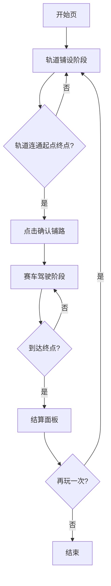

# 双阶段轨道赛车游戏 - 产品需求文档（PRD）

## 1. 产品概述

本项目是一款基于 HTML5 Canvas + 原生 JavaScript 开发的单文件双人阶段制轨道赛车游戏。玩家单人依次完成【轨道铺设阶段】与【赛车驾驶阶段】，最终结算总分 = 用时分数 + 轨道设计分数 + 驾驶特技分数。

- **核心目标**：通过自主铺路 + 自主驾驶的双阶段玩法，让玩家在创作与操作中获得双重乐趣
- **目标用户**：喜爱休闲物理赛车、轨道创作、特技挑战的浏览器游戏玩家
- **市场价值**：单文件零依赖，可直接嵌入任意网页/Trae 实时预览，便于分享与迭代

## 2. 核心功能

### 2.1 用户角色

| 角色 | 注册方式 | 核心权限 |
|------|---------|---------|
| 单人玩家 | 无需注册 | 铺设轨道、驾驶赛车、查看结算 |

### 2.2 功能模块

1. **轨道铺设阶段**：超大开放 2D 地图、随机陷阱/加分点位、鼠标自由绘制轨道、连通性校验、确认铺路
2. **赛车驾驶阶段**：登山赛车物理引擎、W/S 双键操作、翻车自动复位、终点检测
3. **三重计分系统**：用时分数、轨道设计分数、驾驶特技分数、最终结算面板
4. **HUD 界面**：阶段提示、行驶计时、实时三项分数、操作提示

### 2.3 页面详情

| 页面/场景 | 模块名称 | 功能描述 |
|----------|---------|---------|
| 开始页 | 标题与说明 | 游戏标题、玩法说明、开始按钮 |
| 轨道铺设场景 | 地图渲染层 | 渲染超大 2D 地图、起点、终点、陷阱、加分点位 |
| 轨道铺设场景 | 轨道绘制层 | 鼠标拖拽绘制高低起伏连续轨道，实时校验碰撞 |
| 轨道铺设场景 | 控制面板 | 撤销、清空、确认铺路按钮，铺路提示信息 |
| 赛车驾驶场景 | 物理引擎层 | 重力、翘头、翘尾、翻车复位、贴合路面 |
| 赛车驾驶场景 | HUD 层 | 计时器、三项实时分数、操作提示、阶段标识 |
| 结算面板 | 三重分数展示 | 用时分数、轨道设计分数、驾驶特技分数、总分、再玩一次 |

## 3. 核心流程

### 3.1 主流程描述

1. 玩家进入开始页，点击「开始游戏」进入轨道铺设阶段
2. 系统随机生成超大地图，包含起点、终点、固定位置的陷阱与加分点位
3. 玩家使用鼠标在地图上自由绘制连续轨道，系统实时校验是否触碰陷阱
4. 触碰陷阱时给出错误提示，需重新绘制该段轨道
5. 轨道必须完整连通起点与终点，否则无法进入下一阶段
6. 玩家点击「确认铺路」锁定轨道，自动切换至赛车驾驶阶段
7. 车辆从起点出发，玩家通过 W（前进）/ S（后退）控制车辆
8. 长按 W 加速并翘头，翘头过度翻车自动复位；长按 S 减速倒车并翘尾
9. 车辆到达终点，结算三项分数并弹出结算面板
10. 玩家可选择「再玩一次」重新开始

### 3.2 流程图

## 4. 用户界面设计

### 4.1 设计风格

- **主色调**：深空蓝紫渐变背景（#0a0e27 → #1a1f3a）+ 霓虹青绿（#00ffc6）+ 警示橙红（#ff5e3a）
- **辅助色**：金色（#ffd23f）用于加分点位、紫红（#ff2e63）用于陷阱
- **按钮风格**：圆角矩形 + 霓虹发光边框 + 悬停放大微动效
- **字体**：标题使用 Orbitron（科技感显示字体），正文使用 Rajdhani（紧凑无衬线）
- **布局风格**：全屏 Canvas + 顶部 HUD 条 + 左下角操作提示 + 右下角控制面板
- **图标/Emoji**：使用简洁几何符号 + Canvas 绘制图形，避免外部图标依赖

### 4.2 页面设计概览

| 页面/场景 | 模块名称 | UI 元素 |
|----------|---------|---------|
| 开始页 | 标题区 | 大号 Orbitron 标题、副标题说明、霓虹开始按钮、背景粒子动效 |
| 轨道铺设场景 | 地图层 | 网格背景、起点（绿色旗）、终点（红白格子旗）、陷阱（紫红尖刺）、加分点位（金色星标） |
| 轨道铺设场景 | HUD | 阶段标识「PHASE 1 - 铺路」、铺路提示、撤销/清空/确认按钮 |
| 赛车驾驶场景 | HUD | 阶段标识「PHASE 2 - 驾驶」、计时器、三项实时分数条、W/S 操作提示 |
| 赛车驾驶场景 | 车辆 | 简洁几何车身 + 车轮旋转 + 翘头/翘尾动画 + 翻车震动 |
| 结算面板 | 分数展示 | 三项分数卡片 + 总分大字 + 评级（S/A/B/C）+ 再玩一次按钮 |

### 4.3 响应式

- 桌面优先设计，Canvas 自适应窗口大小
- 最小支持 1024×640，推荐 1280×720 以上
- 鼠标交互为主，预留触屏事件接口供后续移动端适配

### 4.4 2D 场景指引

- **环境氛围**：深空科技感，背景星空粒子缓慢飘动
- **光照**：Canvas 2D 模拟，通过渐变与阴影营造立体感
- **镜头**：铺路阶段全图俯视；驾驶阶段跟随车辆平移，含轻微缩放
- **构图**：起点位于左侧，终点位于右侧，陷阱与加分点位散布其间
- **动效**：轨道绘制时发光拖尾、车辆腾空时影子分离、翻车时屏幕震动
- **后处理**：CSS filter 模拟轻微辉光，Canvas globalCompositeOperation 实现霓虹叠加

## 5. 三重计分规则详解

### 5.1 用时分数（权重 40%）

- 基础分 1000 分，每秒扣 5 分
- 走自制近道（轨道长度低于平均参考长度）额外加 200 分
- 全程超时（>120 秒）大额扣分，每超 10 秒扣 50 分
- 最低 0 分

### 5.2 轨道设计分数（权重 30%）

- 途经每个特殊加分点位 +100 分
- 悬空路段每像素 +0.5 分
- 高低落差复杂度（高度方差）+0.01 × 方差值
- 特技路段（坡度 > 45°）每段 +50 分
- 轨道平直单调（高度方差 < 阈值）-100 分
- 绕路冗余（长度 > 参考长度 1.5 倍）-150 分

### 5.3 驾驶特技分数（权重 30%）

- 腾空飞跃每次 +30 分
- 极限翘头行驶（角度 > 45° 持续 > 0.5s）+20 分
- 高空平稳落地（腾空 > 1s 落地无翻车）+50 分
- 坡道特技行驶（坡度 > 45° 行驶）每秒 +10 分
- 翻车每次 -30 分，多次翻车累计扣分

## 6. 拓展接口预留

- 机关系统：陷阱类型注册接口（addTrapType）
- 关卡系统：地图配置 JSON 加载接口（loadLevel）
- 皮肤系统：车辆外观注册接口（setCarSkin）
- 音效系统：事件音效注册接口（playSound）
- 多人模式：分数上传与排行接口（submitScore）
