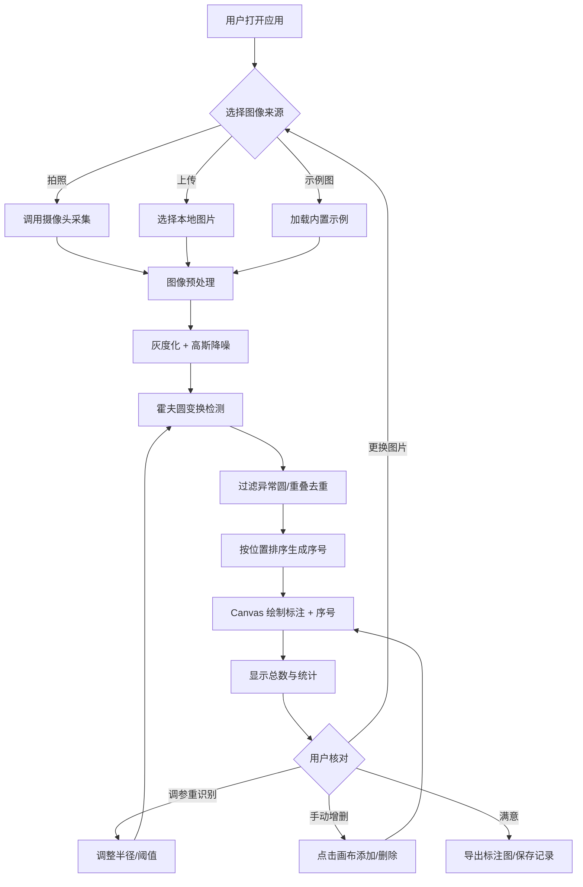

# 手串珠子计数应用 PRD

## 1. 产品概述

一款基于浏览器的极简手串珠子计数工具，用户拍摄或上传手串照片后，应用通过计算机视觉算法自动识别并统计珠子数量，在原图上可视化标注每一颗珠子并显示递增序号，解决文玩爱好者人工数珠繁琐、易错的问题。
- 目标用户：文玩爱好者、手串收藏者、手串商家
- 核心价值：拍照即数珠，秒出结果，可视化核对，替代人工肉眼计数

## 2. 核心功能

### 2.1 功能模块
1. **计数主页**：图像采集入口、识别结果展示、可视化标注画布、操作工具栏
2. **结果核对页**：原图叠加序号标注、总数显示、识别参数调节、重新识别/导出

### 2.2 页面详情

| 页面名称 | 模块名称 | 功能描述 |
|---------|---------|---------|
| 计数主页 | 图像采集区 | 支持调用摄像头拍照、上传本地图片，拖拽上传，提供示例图快速体验 |
| 计数主页 | 识别处理引擎 | 调用 OpenCV.js 进行预处理（灰度、降噪、增强）+ 霍夫圆变换检测珠子，自动排除绳结/缝隙/阴影干扰 |
| 计数主页 | 可视化标注画布 | 在原图上逐颗绘制圆形标注框，标注 1、2、3…递增序号，支持鼠标悬停高亮、点击删除误识别珠子 |
| 计数主页 | 结果统计栏 | 显示总珠子数量（大字号醒目展示）、识别耗时、置信度提示 |
| 计数主页 | 参数调节面板 | 珠子半径范围（最小/最大半径）、检测灵敏度（阈值滑块）、Canny 边缘阈值，支持手动微调重新识别 |
| 计数主页 | 操作工具栏 | 重新识别、手动添加遗漏珠子（点击画布添加）、导出标注图、重置、更换图片 |
| 计数主页 | 历史记录抽屉 | 本地存储最近识别记录（缩略图+数量+时间），支持快速回看 |

## 3. 核心流程

用户打开应用 → 选择拍照/上传图片 → 图像预处理 → 霍夫圆变换检测珠子 → 过滤异常结果 → 在原图绘制序号标注 → 显示总数 → 用户核对（可手动增删/调参重识别）→ 满意后导出或保存记录

## 4. 用户界面设计

### 4.1 设计风格
- **主题方向**：东方文玩雅致风 + 现代极简工具感。融合石珠质感（温润、内敛）与现代工具的精准高效
- **主色调**：墨玉绿（#1F3D2E）为主色，搭配琥珀金（#C8964A）作为强调色，背景采用宣纸米白（#F5F1E8）与深墨色（#1A1A1A）的双主题
- **按钮风格**：圆润胶囊型按钮，主操作按钮带琥珀金渐变与微妙阴影，次操作按钮为描边样式
- **字体**：标题使用「Noto Serif SC」（思源宋体）体现文玩质感，正文使用「Noto Sans SC」（思源黑体）保证可读性，数字使用「JetBrains Mono」体现工具精准感
- **布局风格**：左右分栏布局，左侧图像采集与标注画布（主视觉区），右侧结果统计与参数调节面板
- **图标/装饰**：使用极简线性图标，搭配石珠纹理、墨韵笔触等装饰元素，营造文玩氛围

### 4.2 页面设计概览

| 页面名称 | 模块名称 | UI 元素 |
|---------|---------|---------|
| 计数主页 | 顶部导航栏 | 墨玉绿背景，左侧应用名「珠玑」+ 石珠 logo，右侧主题切换、历史记录按钮 |
| 计数主页 | 图像采集区（空状态） | 居中卡片，虚线边框，上传/拍照/示例三按钮，背景石珠纹理装饰 |
| 计数主页 | 标注画布区 | 主视觉区，圆角卡片包裹 Canvas，左下角显示图像尺寸，右上角悬浮工具按钮（放大/重置） |
| 计数主页 | 结果统计栏 | 琥珀金大数字显示总数，下方小字显示耗时与置信度，带数字滚动动画 |
| 计数主页 | 参数调节面板 | 折叠式面板，半径范围双滑块、灵敏度滑块、阈值输入框，实时预览效果 |
| 计数主页 | 操作工具栏 | 底部胶囊按钮组：重新识别、手动添加、导出、更换图片 |
| 计数主页 | 历史记录抽屉 | 右侧滑出抽屉，卡片列表展示缩略图+数量+时间，点击回看 |

### 4.3 响应式
- 桌面优先（1280px+）：左右分栏布局，画布占据主要空间
- 平板（768-1280px）：保持分栏，参数面板可折叠
- 移动端（<768px）：上下堆叠布局，画布全宽，参数面板底部抽屉式展开，触摸优化（增大按钮命中区域，支持双指缩放画布）

### 4.4 交互细节
- 识别中：画布显示扫描线动画 + 加载提示
- 标注绘制：珠子按序号依次淡入（staggered 动画），增强核对体验
- 悬停珠子：高亮当前珠子，显示序号气泡
- 点击珠子：弹出删除确认，删除后自动重排序号
- 数字结果：CountUp 动画从 0 滚动到目标值
