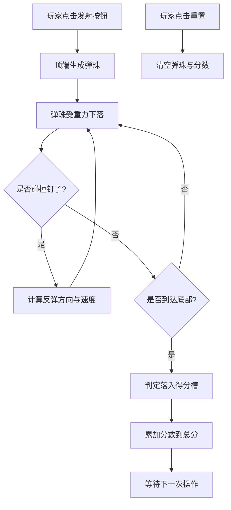

## 1. 产品概述

一款基于原生 HTML/CSS/JavaScript 实现的「倒弹珠（Plinko）」小游戏，单文件可直接在浏览器打开。
- 主要目的：通过物理碰撞模拟，让弹珠从顶端落下、撞击三角形钉阵后随机滚落到底部得分区间
- 目标用户：休闲玩家、想要二次开发的学习者（代码注释清晰，便于修改参数）
- 价值：零依赖、即开即玩、参数可调，适合教学与娱乐

## 2. 核心功能

### 2.1 功能模块
1. **游戏主界面**：画布（钉阵 + 弹珠 + 底部得分槽）、控制按钮、实时分数显示
2. **物理引擎**：原生 JS 实现重力、弹性碰撞、摩擦阻尼
3. **交互控制**：发射单颗弹珠、一键重置游戏

### 2.2 页面详情
| 页面区域 | 模块名称 | 功能描述 |
|----------|----------|----------|
| 主画布 | 三角形钉阵 | 多层交错排列的圆形钉子，弹珠碰撞后随机左右弹落 |
| 主画布 | 弹珠 | 从顶端投放点下落，受重力与碰撞影响 |
| 主画布 | 底部得分槽 | 多个区间，不同区间对应不同分值 |
| 顶部控制栏 | 发射按钮 | 点击投放一颗弹珠 |
| 顶部控制栏 | 重置按钮 | 清空所有弹珠并归零分数 |
| 右上角 | 总分显示 | 实时累加弹珠落入槽位的分值 |

## 3. 核心流程

玩家点击「发射」→ 弹珠从顶端投放点生成 → 受重力下落 → 依次碰撞各层钉子随机偏转 → 落入底部某一得分槽 → 该槽分值累加到总分 → 可继续发射或点击「重置」清空。

## 4. 用户界面设计

### 4.1 设计风格
- 主色调：深色背景（#1a1a2e）+ 暖色弹珠（橙黄渐变）+ 冷色钉子（青蓝）
- 按钮风格：圆角矩形，发射按钮高亮（橙），重置按钮次级（灰）
- 字体：等宽字体显示分数（如 'Courier New'），标题使用无衬线字体
- 布局：顶部控制栏 + 居中画布 + 右上角分数浮窗
- 视觉细节：弹珠带高光、钉子带阴影、得分槽分色渐变

### 4.2 页面设计概览
| 页面区域 | 模块名称 | UI 元素 |
|----------|----------|---------|
| 顶部栏 | 控制区 | 发射按钮（橙）、重置按钮（灰）、标题文字 |
| 右上角 | 分数面板 | 半透明卡片，大号数字显示总分 |
| 主画布 | 游戏区 | Canvas 绘制钉阵、弹珠、得分槽、网格背景 |

### 4.3 响应式
- 桌面优先，画布固定尺寸（如 600×720），居中显示
- 移动端通过 CSS 缩放适配，触摸点击按钮即可

### 4.4 可调参数（代码内注释标注）
- 钉子层数与每层钉数
- 弹珠半径、初速度、重力加速度、弹性系数、摩擦系数
- 得分槽数量与各槽分值
