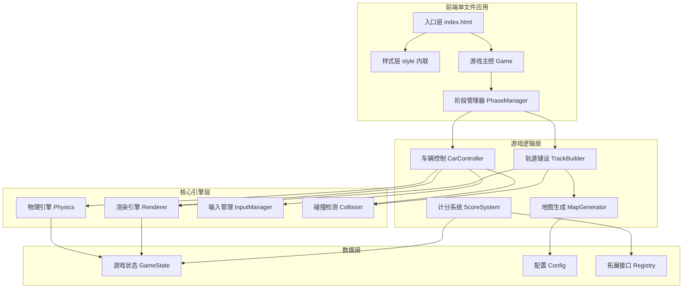
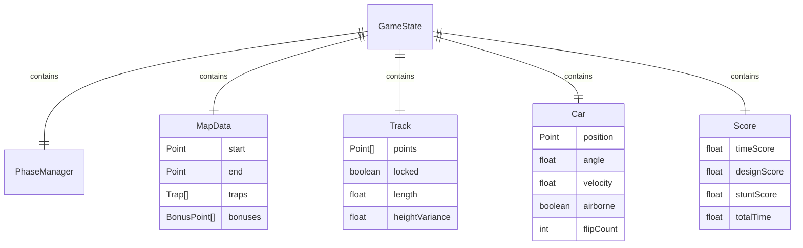

# 双阶段轨道赛车游戏 - 技术架构文档

## 1. 架构设计



## 2. 技术说明

- **前端**：原生 HTML5 Canvas + 原生 JavaScript（ES6+），单文件 `index.html`
- **构建工具**：无，直接浏览器运行，支持 Trae 实时预览
- **后端**：无
- **数据库**：无（所有数据运行时内存存储）
- **依赖**：仅引入 Google Fonts（Orbitron + Rajdhani）CDN 字体

## 3. 模块划分（单文件内分层）

| 模块 | 职责 | 关键类/对象 |
|------|------|------------|
| Game | 游戏主循环、阶段切换 | `Game` |
| PhaseManager | 阶段状态机（START/BUILD/DRIVE/END） | `PhaseManager` |
| Renderer | Canvas 绘制、镜头跟随、HUD | `Renderer` |
| Physics | 重力、翘头/翘尾、翻车复位 | `Physics` |
| InputManager | 鼠标绘制、键盘 W/S | `InputManager` |
| Collision | 点-陷阱、车-轨道碰撞 | `Collision` |
| MapGenerator | 随机生成陷阱、加分点位、起终点 | `MapGenerator` |
| TrackBuilder | 轨道点序列、连通性校验、锁定 | `TrackBuilder` |
| CarController | 车辆状态、车轮旋转、姿态 | `CarController` |
| ScoreSystem | 三项分数实时计算与结算 | `ScoreSystem` |
| Registry | 拓展接口（机关/关卡/皮肤/音效） | `Registry` |

## 4. 数据模型

### 4.1 核心数据结构



### 4.2 关键数据定义

```javascript
// 阶段枚举
const Phase = { START: 0, BUILD: 1, DRIVE: 2, END: 3 };

// 陷阱类型
const TrapType = { SPIKE: 'spike', PIT: 'pit', WALL: 'wall' };

// 加分点位类型
const BonusType = { FLOAT_ROAD: 'float', BOOST_RAMP: 'ramp', SHORTCUT: 'shortcut', STUNT_PLATFORM: 'stunt' };

// 轨道点（含高度）
// { x, y, height, isAir }

// 车辆状态
// { x, y, angle, angularVelocity, velocityX, velocityY, onGround, flipCount, stuntTimer }
```

## 5. 物理引擎核心算法

### 5.1 登山赛车物理（简化版）

```text
每帧更新：
1. 读取输入：W → 加速力 forwardForce；S → 反向力 backwardForce
2. 计算车辆当前所在轨道段，获取切线方向与坡度
3. 重力分量：gravity * sin(slope) 沿轨道切线方向
4. 合力 = forwardForce + backwardForce + gravityComponent - friction
5. 加速度 = 合力 / mass
6. 速度 += 加速度 * dt
7. 位置 += 速度 * dt
8. 翘头/翘尾：W 持续按下 → angle += tiltRate；S → angle -= tiltRate
9. 翻车判定：|angle| > 90° → 触发翻车，扣分，0.8s 后复位到当前轨道点
10. 腾空判定：车辆位置距轨道 > 阈值 → airborne = true，仅受重力
11. 落地判定：airborne 且重新贴近轨道 → 触发落地评分
```

### 5.2 轨道绘制与校验

```text
鼠标按下 → 开始绘制新段
鼠标移动 → 添加点（间隔采样，避免过密）
每个新点：
  - 检查是否与任何陷阱碰撞 → 是则提示错误，丢弃该点
  - 检查与上一段的高度差 → 计算悬空/落差
鼠标抬起 → 结束当前段
确认铺路：
  - 检查起点连通（首段靠近 start）
  - 检查终点连通（末段靠近 end）
  - 通过则锁定，进入驾驶阶段
```

## 6. 渲染层级

| 层级 | 内容 | Z-Order |
|------|------|---------|
| 0 | 背景星空粒子 | 最底 |
| 1 | 地图网格 | |
| 2 | 陷阱、加分点位 | |
| 3 | 起点终点标记 | |
| 4 | 轨道（含高度阴影） | |
| 5 | 车辆 + 影子 | |
| 6 | HUD（阶段/计时/分数/提示） | 最顶 |

## 7. 拓展接口设计

```javascript
// 机关系统
Registry.registerTrap('lava', { color: '#ff4500', onHit: (car) => {...} });

// 关卡系统
Registry.loadLevel({ start, end, traps, bonuses, parTime });

// 皮肤系统
Registry.setCarSkin({ body: '#00ffc6', wheel: '#ffd23f' });

// 音效系统
Registry.on('engine', () => playSound('engine.mp3'));
Registry.on('flip', () => playSound('crash.mp3'));
Registry.on('bonus', () => playSound('coin.mp3'));
```

## 8. 性能优化

- Canvas 双缓冲：主 Canvas + 离屏 Canvas 预渲染静态层
- 轨道点采样间隔 ≥ 8px，避免过密
- 物理更新固定步长 60fps，渲染跟随 requestAnimationFrame
- 镜头裁剪：仅绘制视口内可见元素
- 粒子数量限制 ≤ 100

## 9. 文件结构

```text
/workspace
├── index.html              # 单文件完整游戏（HTML + CSS + JS）
└── .trae
    └── documents
        ├── PRD.md
        └── TechnicalArchitecture.md
```
