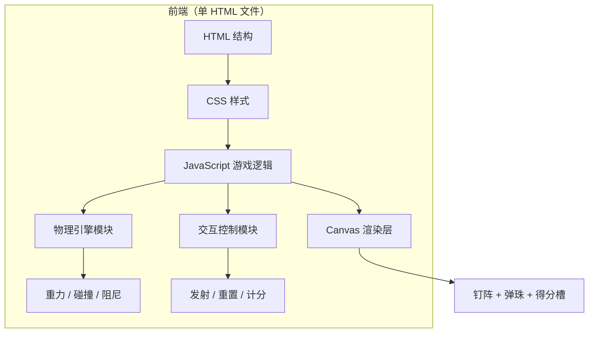

## 1. 架构设计



## 2. 技术说明
- 前端：原生 HTML5 + CSS3 + JavaScript（ES6），无任何外部依赖
- 渲染：Canvas 2D API
- 物理：自实现简易刚体碰撞（圆-圆碰撞 + 反射向量）
- 初始化工具：无需构建，浏览器直接打开 `.html` 文件即可运行
- 后端：无
- 数据库：无（分数仅存于内存，重置后清空）

## 3. 文件结构
| 文件 | 用途 |
|------|------|
| `plinko.html` | 唯一文件，包含 HTML/CSS/JS，可直接双击打开 |

## 4. 核心模块设计

### 4.1 物理引擎
- **重力**：每帧给弹珠 y 方向速度叠加 `gravity`
- **碰撞检测**：弹珠（圆）与钉子（圆）距离 < 半径之和时触发
- **碰撞响应**：沿法线方向反射速度，乘以弹性系数（restitution）损耗能量
- **阻尼**：每帧速度乘以摩擦系数（friction），避免无限弹跳
- **边界**：左右墙反弹，底部得分槽吸收弹珠

### 4.2 钉阵布局
- 三角形排列：第 i 层有 i+1 个钉子，层间距固定
- 居中对齐，整体相对画布水平居中

### 4.3 得分槽
- 底部按等宽划分 N 个槽位
- 每个槽位预设分值（中间低、两侧高，类似真实 Plinko）
- 弹珠中心 x 落入某槽即结算该槽分值

### 4.4 可调参数（集中在 JS 顶部 CONFIG 对象）
```javascript
const CONFIG = {
  pegRows: 10,           // 钉子层数
  pegSpacing: 50,        // 钉子水平间距
  pegRadius: 6,          // 钉子半径
  ballRadius: 8,         // 弹珠半径
  gravity: 0.25,         // 重力加速度
  restitution: 0.6,      // 弹性系数
  friction: 0.998,       // 摩擦系数
  slots: [100,50,20,10,5,10,20,50,100] // 得分槽分值
};
```

## 5. 交互流程
1. 点击「发射弹珠」→ 在顶端投放点创建一颗弹珠，赋予微小随机水平速度
2. requestAnimationFrame 循环更新物理 + 渲染
3. 弹珠落入底部槽位 → 累加分数 → 移除该弹珠
4. 点击「重置」→ 清空弹珠数组、分数归零、重绘静态场景
