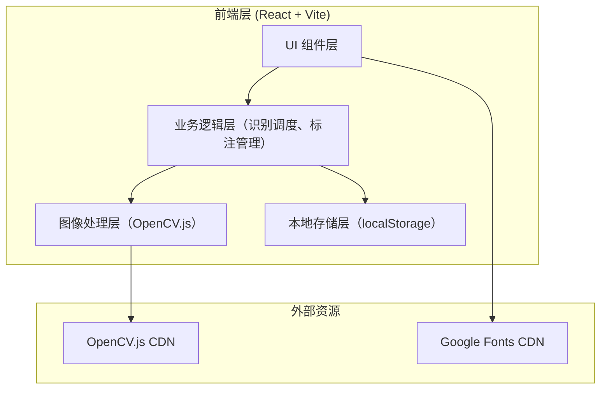

# 手串珠子计数应用 技术架构文档

## 1. 架构设计

纯前端架构，无后端服务。图像处理算法（OpenCV.js）在浏览器端运行，识别结果与历史记录存储于浏览器本地。



## 2. 技术说明

- **前端框架**：React@18 + TypeScript
- **构建工具**：Vite@5
- **样式方案**：TailwindCSS@3
- **图像处理**：OpenCV.js（通过 CDN 动态加载，提供霍夫圆变换、高斯滤波、Canny 边缘检测等能力）
- **画布渲染**：原生 Canvas 2D API（绘制标注与序号）
- **状态管理**：React Context + useReducer（轻量级，无需引入 Redux）
- **本地存储**：localStorage（历史记录持久化）
- **后端**：无（纯客户端运行，保护隐私，无需上传图片到服务器）
- **数据库**：无

## 3. 路由定义

| 路由 | 用途 |
|------|------|
| / | 计数主页（图像采集、识别、标注、结果展示一体化） |

## 4. 核心算法说明

### 4.1 珠子检测流程
1. **图像预处理**：转灰度 → 高斯模糊降噪（消除细小纹理干扰）
2. **边缘检测**：Canny 算法提取珠子边缘
3. **霍夫圆变换**：`cv.HoughCircles` 检测圆形珠子，参数包括：
   - `dp`：累加器分辨率比（默认 1.2）
   - `minDist`：圆心最小间距（根据预估珠子半径设置）
   - `param1`：Canny 高阈值（默认 100）
   - `param2`：累加器阈值（默认 30，越小越敏感）
   - `minRadius` / `maxRadius`：珠子半径范围（用户可调）
4. **后处理过滤**：
   - 去除重叠圆（IOU 过滤）
   - 去除半径异常圆（偏离中位数过远）
   - 按位置排序（从左到右、从上到下）生成序号

### 4.2 OpenCV.js 加载策略
- 应用启动时异步加载 OpenCV.js（约 8MB）
- 加载期间显示进度提示与功能预览
- 加载完成后初始化算法模块，解锁识别功能

## 5. 数据模型

### 5.1 核心数据结构

```typescript
// 检测到的珠子
interface Bead {
  id: string;
  x: number;          // 圆心 x 坐标
  y: number;          // 圆心 y 坐标
  radius: number;     // 半径
  order: number;      // 序号（从 1 开始）
  confidence: number; // 置信度
}

// 识别参数
interface DetectParams {
  minRadius: number;
  maxRadius: number;
  threshold: number;    // param2
  cannyThreshold: number; // param1
}

// 识别结果
interface DetectionResult {
  beads: Bead[];
  totalCount: number;
  duration: number;     // 耗时(ms)
  params: DetectParams;
  timestamp: number;
}

// 历史记录
interface HistoryRecord {
  id: string;
  thumbnail: string;    // base64 缩略图
  totalCount: number;
  timestamp: number;
  params: DetectParams;
}
```

### 5.2 本地存储结构
- `bead-counter:history`：历史记录数组（最多保留 20 条，超出删除最早的）
- `bead-counter:settings`：用户上次使用的检测参数（便于下次默认填充）

## 6. 性能优化

- **大图压缩**：上传图片超过 2000px 时按比例压缩至 2000px 内，保证识别速度
- **Web Worker**：将 OpenCV 检测任务放入 Web Worker，避免阻塞 UI 渲染
- **防抖**：参数调节滑块使用防抖（300ms），避免频繁触发重识别
- **Canvas 重绘优化**：仅在珠子列表变化时重绘，鼠标交互使用单独的 overlay canvas
